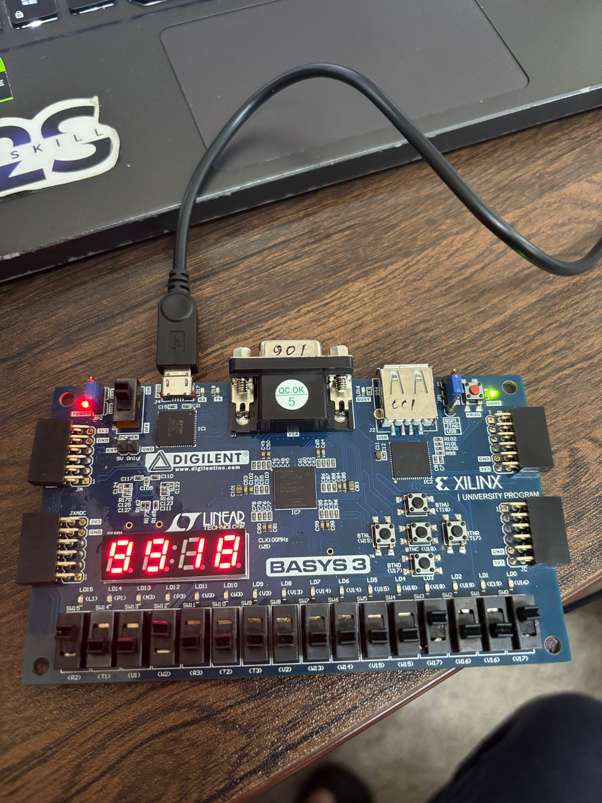

<div align="center">

# FPGA Mini Projects Collection

[](/)
[](https://www.xilinx.com/products/silicon-devices/fpga/artix-7.html)
[](https://www.xilinx.com/products/design-tools/vivado.html)
[](https://digilent.com/)
[](/)

**A collection of 17 digital design mini-projects implemented in Verilog HDL for FPGA deployment**

[Projects](#projects) | [Hardware](#hardware-setup) | [Demos](#demonstrations) | [Getting Started](#getting-started) | [Author](#author)

</div>

---

## About

These projects were developed during the **FPGA Design Internship at NIELIT (National Institute of Electronics and Information Technology), Calicut** from May 2025 to July 2025. The internship focused on digital system prototyping using FPGAs with hands-on training in Verilog HDL implementation.

| | |
|---|---|
| **Institution** | NIELIT Calicut |
| **Duration** | May 2025 - July 2025 |
| **Role** | FPGA Design Intern |
| **Boards** | Basys-3, Arty A7 |
| **Tools** | Vivado, ModelSim |

### Key Learning Outcomes

- Developed and tested digital designs on **Arty A7** and **Basys 3** FPGAs using Verilog HDL
- Built modules like priority encoders, 8-bit FIFO, matrix multipliers, and FIR filters
- Performed waveform analysis using **ILA (Integrated Logic Analyzer)** and **VIO (Virtual I/O)**
- Wrote self-checking testbenches and XDC constraints
- Implemented debouncing and CDC (Clock Domain Crossing) where needed
- Closed timing at **100 MHz** on Basys 3/Arty A7
- Verified designs on hardware with **UART prints** alongside ILA/VIO

---

## Overview

This repository contains a comprehensive collection of FPGA mini-projects designed for learning and practicing digital design concepts. Each project demonstrates fundamental to intermediate digital logic concepts, from basic combinational circuits to sequential state machines.

<div align="center">


*Basys-3 FPGA board running 7-segment display project*
</div>

---

## Projects

### Arithmetic Units

| Project | File | Description |
|---------|------|-------------|
| **4-Bit Adder** | `4bitadder.xpr` | Basic 4-bit binary addition circuit |
| **Ripple Carry Adder** | `RCA.xpr` | Multi-bit adder using cascaded full adders |
| **FPGA ALU** | `fpgaALU.xpr` | Arithmetic Logic Unit with addition/multiplication |
| **Magnitude Comparator** | `mag_comp.xpr` | Compares two binary numbers (>, <, =) |

### Display & Interface

| Project | File | Description |
|---------|------|-------------|
| **BCD to 7-Segment** | `BCD7seg.xpr` | Converts BCD input to 7-segment display patterns |
| **PWM LED Control** | `pwmLed.xpr` | Pulse-width modulation for LED brightness control |

### Combinational Logic

| Project | File | Description |
|---------|------|-------------|
| **4x1 Multiplexer** | `mux4x1.xpr` | 4-to-1 data selector circuit |
| **Bitwise Operations** | `bitwiseops.xpr` | AND, OR, XOR, NOT logic operations |

### Sequential Circuits

| Project | File | Description |
|---------|------|-------------|
| **Flip-Flops** | `flipflops.xpr` | D, T, JK, and SR flip-flop implementations |
| **Sequential Circuit** | `sqlckt.xpr` | State machine design practice |
| **Stop-Wait-Go** | `stopwaitgo.xpr` | Traffic light controller FSM |

### Signal Processing

| Project | File | Description |
|---------|------|-------------|
| **FIR Filter** | `FIRfilter.xpr` | 3-tap [1,2,1] digital FIR filter |
| **EPC** | `EPC.xpr` | Error correction/detection circuit |

### Application Projects

| Project | File | Description |
|---------|------|-------------|
| **Digital Safe System** | `digsafesystem.xpr` | 4-bit code verification security system |
| **Car Parking System** | `carpark.xpr` | Parking space counter/controller |
| **Test IP** | `testIP.xpr` | IP core testing and verification |
| **Parallel Practice** | `parapractice.xpr` | Parallel data processing exercises |

---

## Hardware Setup

| Component | Specification |
|-----------|---------------|
| **FPGA Boards** | Digilent Basys-3, Digilent Arty A7 |
| **FPGA Chip** | Xilinx Artix-7 (XC7A35T-1CPG236C) |
| **Clock** | 100 MHz onboard oscillator |
| **Switches** | 16 slide switches for input |
| **Buttons** | 5 push buttons |
| **LEDs** | 16 user LEDs |
| **7-Segment** | 4-digit multiplexed display |

---

## Demonstrations

Video demonstrations of the projects running on hardware:

| Demo | Description |
|------|-------------|
| [ALU Demo 1](demos/videos/alu_demo_1.mp4) | Arithmetic operations demonstration |
| [ALU Demo 2](demos/videos/alu_demo_2.mp4) | Extended ALU functionality |
| [7-Segment Demo](demos/videos/seven_segment_demo.mp4) | Display multiplexing in action |
| [LED Counter](demos/videos/led_counter_demo.mp4) | Counter with LED visualization |

---

## Getting Started

### Prerequisites

- **Xilinx Vivado** 2023.x or later
- **ModelSim** (for simulation)
- **Digilent Basys-3** or **Arty A7** FPGA board (for hardware testing)

### Opening Projects

1. Clone this repository:
   ```bash
   git clone https://github.com/DarkDragoXE/FPGA-Based-Mini-projects.git
   ```

2. Open Vivado and load any project:
   ```
   File -> Open Project -> projects/<project_name>.xpr
   ```

3. Generate bitstream and program the FPGA:
   ```
   Flow Navigator -> Generate Bitstream -> Program Device
   ```

---

## Project Structure

```
FPGA-Based-Mini-projects/
├── README.md
├── projects/               # Vivado project files (.xpr)
│   ├── 4bitadder.xpr
│   ├── fpgaALU.xpr
│   ├── FIRfilter.xpr
│   └── ... (17 projects)
├── demos/
│   └── videos/            # Hardware demonstration videos
│       ├── alu_demo_1.mp4
│       ├── alu_demo_2.mp4
│       ├── seven_segment_demo.mp4
│       └── led_counter_demo.mp4
└── images/                # Documentation images
    └── basys3_demo.jpeg
```

---

## Key Concepts Covered

| Category | Topics |
|----------|--------|
| **Combinational** | Adders, Multiplexers, Comparators, Logic Gates |
| **Sequential** | Flip-Flops, Counters, State Machines |
| **Arithmetic** | Binary Addition, Multiplication, ALU Design |
| **Signal Processing** | FIR Filtering, Digital Signal Processing |
| **I/O Interfacing** | 7-Segment Display, PWM, LED Control |
| **Debugging** | ILA, VIO, UART verification |
| **Applications** | Security Systems, Traffic Controllers |

---

## Toolchain

| Tool | Version | Purpose |
|------|---------|---------|
| **Xilinx Vivado** | 2024.1 | Synthesis, Implementation, Simulation |
| **ModelSim** | - | Behavioral Simulation |
| **Verilog HDL** | IEEE 1364-2005 | Hardware Description |
| **Basys-3/Arty A7 Board Files** | Latest | Constraint files and pin mapping |

---

## Verification Methodology

- **Self-checking testbenches** for automated verification
- **XDC constraints** for proper pin mapping and timing
- **Debouncing** for button inputs
- **CDC (Clock Domain Crossing)** handling where needed
- **ILA/VIO** for on-chip debugging
- **UART prints** for hardware verification
- **Timing closure** at 100 MHz

---

## Author

**Debtonu Bose**
B.Tech Electronics and Communication Engineering
Vellore Institute of Technology (2021-2025)

[](https://github.com/DarkDragoXE)
[](https://linkedin.com/in/debtonu-bose)

---

## Acknowledgments

- **NIELIT Calicut** for providing FPGA training and lab resources
- Digital System Prototyping using FPGAs certification (May 2025)

---

## Future Enhancements

- [ ] Add Verilog source files to repository
- [ ] Include testbenches for each module
- [ ] Add constraint files (.xdc)
- [ ] Create detailed documentation for each project
- [ ] Add simulation waveform screenshots

---

<div align="center">

**FPGA Design | NIELIT Calicut | Verilog HDL**

</div>
